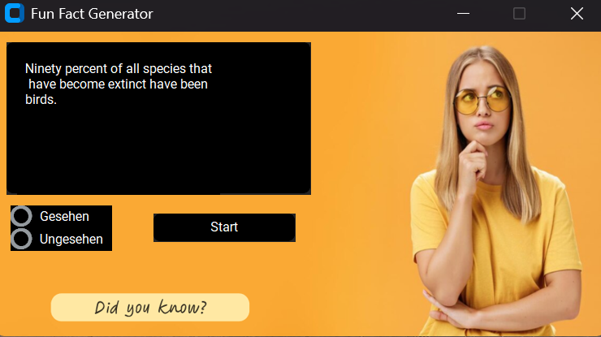

# **API Project Week** #
This project was developed by Katharina, Daria, Martha, Birol, and Dorian. It uses an API and the CTk framework in Python to deliver fun facts from an API and display them in a simple desktop application.

## **Project Description** ##
This project aims to fetch random fun facts using an external API and store them in a PostgreSQL database. The data is then displayed through a graphical user interface (UI) built with CustomTkinter (CTk).

## **Installation** ##
### To set up the project locally, follow these steps: ###

#### **1. Clone the repository** ####

*git clone hthttps://github.com/Doriandevs86/API_Projektwoche*

#### **2. Navigate to the project directory** ####

*cd API_Projektwoche*

## **Setup and Usage Instructions** ##

Please follow the steps below to set up and run the project correctly:

#### **1. Create the Database** ####

Open the *src* folder and execute the file *1.create_fun_facts_db_by_martha.py.*
PyCharm should automatically open. Make sure all necessary modules are installed. If not, open the Python console and run the following command to install the required module:
*pip install psycopg2*

Enter your PostgresPasswort to run the file

#### **2. Connect to the Database** ####

Open your PostgreSQL database and connect to *Postgre@localhost.**
Enter your username and password, then test the connection before clicking **Apply**.

#### **3. Open the Fun Fact Database** ####

After a successful connection, you will see *postgres@localhost[1 of xx]*. Double-click on it and select *fun_fact_db*.
In the left panel, under *fun_fact_db[0 of 3]*, select Default Schema.

#### **4. Export API Data** ####

Open the file *2.API_csv_export_by_birol.py* and run it.

#### **5. Check the CSV File** ####

After the export is complete, you will find the *fakten.csv* file in the *src* folder.

#### **6. Load CSV Data into PostgreSQL** ####

Open the file *3.load_csv_to_postgres_by_dorian.py*. Enter your password again and run it to load the fun fact data into the database table.

#### **7. Run the Fun Fact API** ####

Open and execute the file *4.Funfacts_API_by_daria.py*.

#### **8. Start the API Server** ####

Enter your password to start the API server.

#### **9. Launch the Application** ####

Open and run *5.app_by_katharina.py*.

#### **10. Access the UI** ####

The user interface will open on your desktop.

#### **11. Get a Random Fun Fact** ####

To pick a random fun fact, simply click the **Start** button.

## Contributing ##
If you'd like to contribute to this project, feel free to fork the repository and submit a pull request. Make sure to follow these guidelines:

- Write clear commit messages.
- Ensure your code follows the existing style.
- Test your changes thoroughly.

## License ## 
This project is licensed under the MIT License - see the LICENSE file for details.

## Contact ##
For any questions, you can reach out to the developers:

- Katharina: katharina@example.com
- Daria: daria@example.com
- Martha: martha@example.com
- Birol: birol@example.com
- Dorian: dorian@example.com